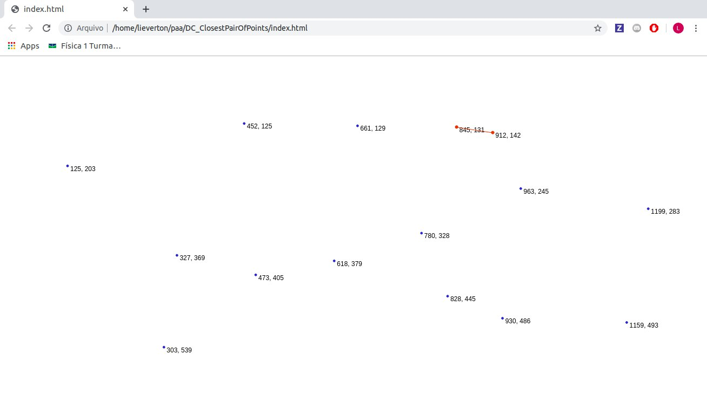

# Par de Pontos Mais Próximos

**Número da Lista**: Lista 4 
**Conteúdo da Disciplina**: Dividir e Conquistar - Par de Pontos Mais Próximos

## Alunos
|Matrícula | Aluno |
| -- | -- |
| 17/0039251  |  Lieverton Santos Silva |
| 17/0024121  |  Welison Lucas Almeida Regis |

## Sobre 
O projeto é a visualização de um algoritmo de dividir e conquistar que encontra o par de pontos mais próximos. 
[algoritmo base](https://www.geeksforgeeks.org/closest-pair-of-points-using-divide-and-conquer-algorithm/)

## Screenshots

## Instalação 
**Linguagem**: JavaScript 
**Framework**: d3.js 
Para executar o projeto basta abrir arquivo index.html em seu browser de preferência.
